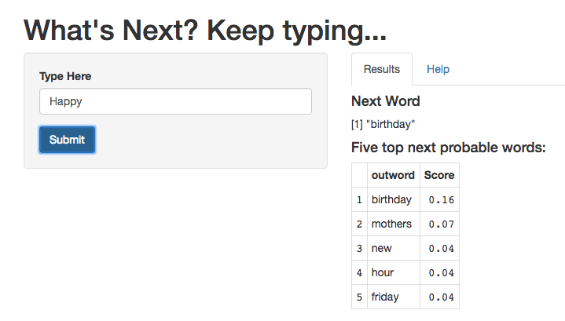

Word Prediction
========================================================
author: Sabin Khadka
date: 06/19/2016
autosize: true

*Final Capstone project for 'Data Science Specialization'*

*John Hopkins University/Coursera*

Objective
========================================================
transition: rotate
transition-speed: slow

**Build a shiny apps to predict next word based on previous words**

*Data Source*
- Data was provided from Swiftkey https://d396qusza40orc.cloudfront.net/dsscapstone/dataset/Coursera-SwiftKey.zip 

*Approach*
- For the purpose of this project we've only used the English Corpora and built word prediction model for English word. From the documents provided, use Natural Language Processing  techniques (in R) build a predictive model. 

Data Processing
========================================================
transition: rotate
transition-speed: slow
- For this project news.txt, twits.txt and blogs.txt was used to build corpora. (Tweets were left out because of the short format and slangs).
- For data cleaning and exploration various R libraries were used: tm, NLP, wordcloud, ggplot).
- Here only 20% of the data (chosen randomly) from twits.txt, news.txt and blogs.txt were taken into consideration for building model due to memory constraint.
- Various data cleaning techniques were applied during data processing (and will be duplicated when taking input data to put it in same platform) : *Remove whitespace, numbers, punctuations and stop words* and also *changed to lower case*

Predicitve Model
========================================================
Algorithm implemented: Stupid Backoff (simple and memory friendly)
- Start with trigram.
- If not in trigram backoff to bigram multiplying probability with some lambda value.
- If not in bigram backoff to unigram multiplying probability with lambda^2 value.
- How was model's performace measured: Predict last word of sentences (N words) in test datasets given N-1 words. If last word (Nth) of sentence was among top 5 predicted word then model did a good job.

Shiny Implementation
===

- Enter input word and click submit button.

- App will suggest you next word and top five probable words

